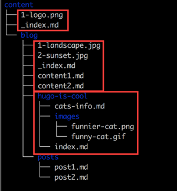

## Introduction

Hugo `0.32` announced page-relative images and other resources packaged into `Page Bundles`.

Page Bundles are a way to group Page Resources.

These terms are connected, and you also need to read about [Page Resources](https://gohugo.io/content-management/page-resources/) and [Image Processing](https://gohugo.io/content-management/image-processing/) to get the full picture.

Example:



Note: The illustration shows 3 bundles. Note that the home page bundle cannot contain other content pages, but other files (images etc.) are fine.

## Bundles' Category

A Page Bundle can be one of:

* Leaf Bundle (leaf means it has no children)
* Branch Bundle (home page, section, taxonomy terms, taxonomy list)
* Headless Bundle

### Leaf Bundle

Collection of resources (pages, images, pdf etc.) for **single** pages. Doesn’t allow nesting of more bundles under it.

A Leaf Bundle is a directory at any hierarchy within the `content/` directory, that contains an `index.md` file. And template `single` will be applied to it.

Example: `content/posts/my-post/index.md`

### Branch Bundle

Collection of non-page resources (images etc.)for **list** pages. Allows nesting of leaf/branch bundles under it.

A Branch Bundle is any directory at any hierarchy within the `content/` directory, that contains at least an `_index.md` file. And template `list` will be applied to it.

Example: `content/posts/_index.md`

### Headless Bundle

A headless bundle is a bundle that is configured to not get published anywhere. They'll not be rendered in `/public`. But you can access them by `.Site.GetPage`, for example:

```
{{ $headless := .Site.GetPage "page" "some-headless-bundle" }}
{{ $reusablePages := $headless.Resources.Match "author*" }}
<h2>Authors</h2>
{{ range $reusablePages }}
    <h3>{{ .Title }}</h3>
    {{ .Content }}
{{ end }}
```

A leaf bundle can be made headless by adding `headless: true` in the Front Matter (in the `index.md`).

There are many use cases of such headless page bundles:

- Shared media galleries
- Reusable page content "snippets"